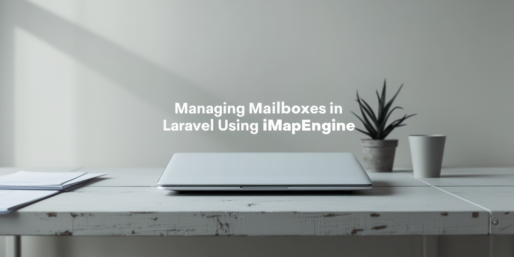

# Managing Mailboxes in Laravel Using ImapEngine

## Overview

This article explores how to manage mailboxes in Laravel using the `ImapEngine` package. It covers installation,
connecting to an IMAP server, retrieving emails, and automating price import email processing with Laravel commands and
queues.

## Read the Full Article

[Managing Mailboxes in Laravel Using ImapEngine](https://dev.to/tegos/managing-mailboxes-in-laravel-using-imapengine-17c8)

